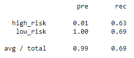

# Credit_Risk_Analysis

## Purpose

The purpose of this assignment is to make use of machine learning models in order to demonstrate the ways that an artificial intelligence might be able to calculate credit risk, as well as the accuracy, precision, and sensitivity therein that would come from training it in these various ways. These methods include oversampling and/or undersampling, using balanced random forest classifiers, and using easy ensemble classifiers.

## Analysis

### Oversampling

The first sampling methods we tested were of random oversampling and oversampling via the SMOTE algorithm.

For the random oversampling:
- The balanced accuracy score was about 0.677.
- The precision and recall for both high_risk and low_risk can be seen below:

For the SMOTE oversampling:
- The balanced accuracy score was about 0.662.
- The precision and recall for both high_risk and low_risk can be seen below:

As can be seen, the precision values for each are about the same: 0.01 and 1.00, with an average precision of 0.99. The recall values are different, however: random oversampling has a slightly higher recall rate for high-risk of 0.69, compared to 0.63, while it recalls low-risk worse than SMOTE at a 0.66, compared to 0.69. Considering both would miss flagging about 30% of all high-risk households, these numbers aren't great, but they could be worse.

### Undersampling and Combination Sampling

The next sampling methods we tested were using the Cluster Centroids algorithm and the SMOTEENN algorithm, which are undersampling and combination sampling methods respectively.

For Cluster Centroids:
- The balanced accuracy score was about 0.545.
- The precision and recall can be seen below:

For SMOTEENN:
- The balanced accuracy score was about 0.645.
- The precision and recall can be seen below:

At this point it's pretty clear that precision won't play much of a matter here -- the more useful data will be within recall. While Cluster Centroids and SMOTEENN algorithms do a slightly better job with flagging high-risk households, they are much worse at making sure most low-risk households remain unflagged.

### Balanced Random Forest and Easy Ensemble

The final methods we used were Ensemble learners, namely using the Balanced Random Forest algorithm and Easy Ensemble algorithm.

For Balanced Random Forest:
- The balanced accuracy score was about 0.789.
- The precision and recall can be seen below:

- Additionally, we compiled a list of feature importance for the features in our X Dataframe:

For Easy Ensemble:
- The balanced accuracy score was about 0.932.
- The precision and recall can be seen below:

Once more the recall rates are of note. This time, both ensemble methods of machine learning produced much, much better results, being all-around higher than any of the oversampling and undersampling methods, and in the case of Easy Ensemble, by a significant amount.

## Summary

Inevitably, the point of using machine learning to predict credit risk is to avoid incorrectly flagging households that have low credit risk, and failing to flag households with high credit risk. In terms of oversampling, the results were alright without regard to the innate imbalance, but when the numbers were considered, fell to a mediocre standing. Undersampling and SMOTEENN were both mediocre in a vacuum, but then looked outright bad once the imbalance issue came into question. The only objectively good answers to this issue were the Ensemble machine learning methods: Balanced Random Forest had a high recall for high-risk households and an even higher recall for low-risk households, scoring 0.70 and 0.87 respectively, while Easy Ensemble scored 0.92 and 0.94 respectively.

Hands-down, Easy Ensemble would be the best solution to the issue of predicting credit risk. There would still be a few false flags and a few that slip by without being flagged, but overall, it would more accurately flag than any of the other solutions.
